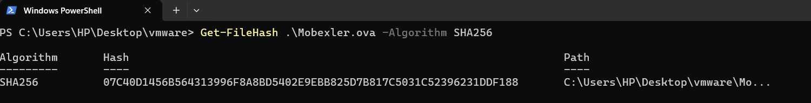
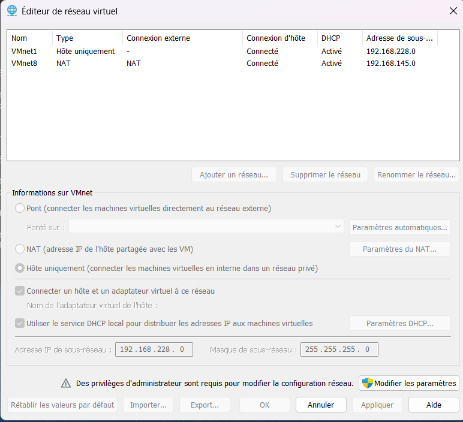
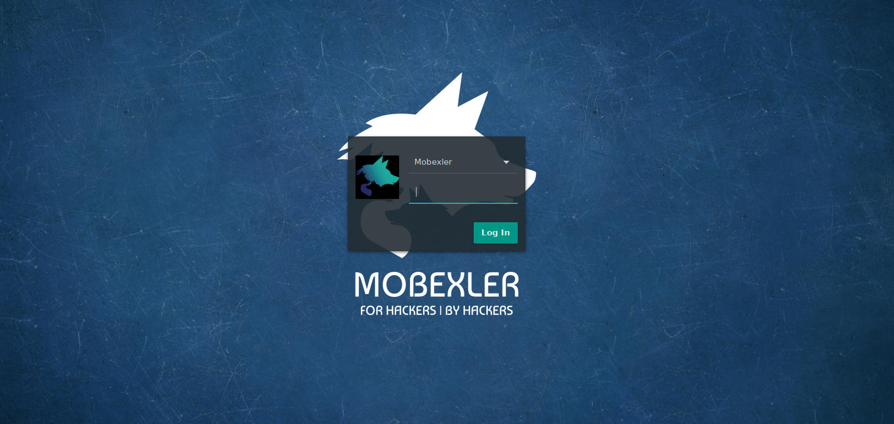
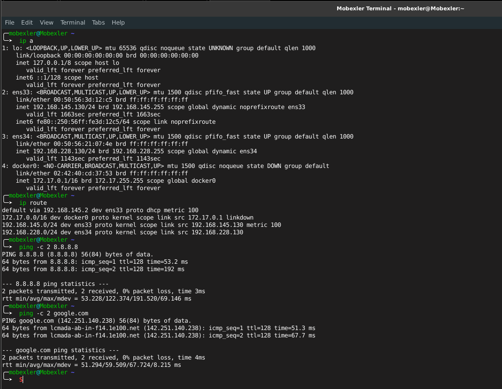
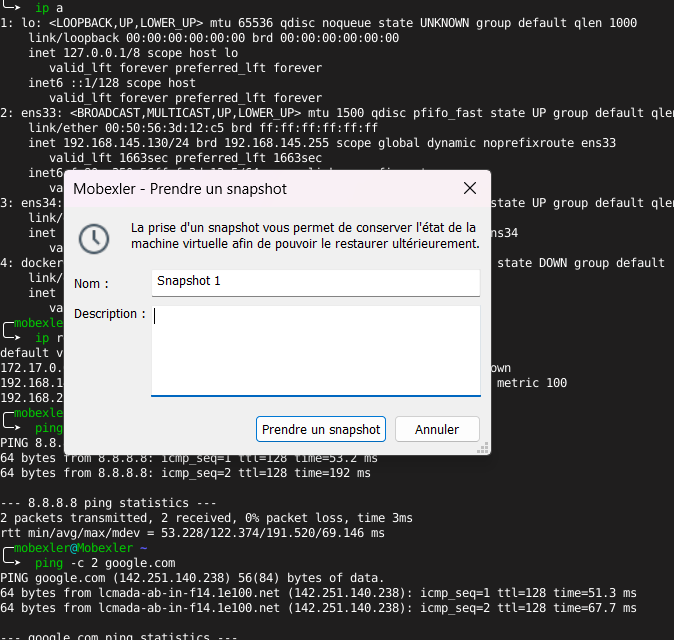
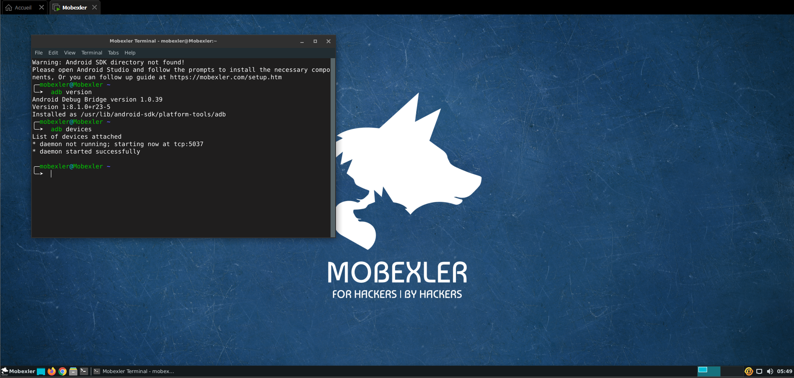

# 🖥️ LAB 1 : Mise en place du lab Mobexler

## 📋 Description
Configuration de l'environnement de test pour le cours **"Sécurité des applications mobiles"**.  
Installation de Mobexler (VM spécialisée), configuration réseau et connexion d'un appareil Android.

## 🎯 Objectifs pédagogiques
- Installation d'une machine virtuelle avec VirtualBox
- Configuration réseau (NAT + Host-Only)
- Vérification de la connectivité Internet
- Création d'un snapshot CLEAN
- Connexion d'un appareil Android via ADB

## 📸 Captures d'écran

### Étape 1: Téléchargement de Mobexler.ova
Téléchargement du fichier OVA (~4-5GB) depuis Google Drive.  
*Vérifier l'intégrité du fichier avec sha256sum.*

### Étape 2: Import dans VirtualBox avec 2 cartes réseau
Configuration importante : 
- **Carte 1** : NAT (pour Internet)
- **Carte 2** : Host-Only (pour communication avec le téléphone)

### Étape 3: Premier démarrage et login
Connexion à Mobexler avec les identifiants :
- **Username** : `mobexler`
- **Password** : `mobexler`

### Étape 4: Vérification réseau
Tests de connectivité :
- `ip a` : vérifier les adresses IP (NAT et Host-Only)
- `ping 8.8.8.8` : tester la connexion Internet
- `ping google.com` : tester la résolution DNS

### Étape 5: Création du snapshot CLEAN
Création d'un point de restauration `CLEAN_BASELINE_TP1` pour pouvoir revenir à cet état après modifications.

### Étape 6: Connexion Android - adb devices
Vérification que le téléphone (ou émulateur) est bien détecté :

