# LAB 2 : Rooting Android
**Cours : Sécurité des applications mobiles**  
**Auteur :** Abdessamad Adansar 
**Plateforme :** MLIAEdu

---

## Avant de commencer

Ce laboratoire a pour objectif de comprendre ce que le rooting change sur un système Android, quoi vérifier, comment tracer les actions, et comment remettre l'environnement à zéro.

**Règles appliquées :**
- App de test + labo uniquement
- Données fictives uniquement
- Rien ne sort du périmètre de test

---

## Étape 1 : Rooter l'AVD

### Commandes exécutées

```powershell
adb root
adb remount
adb shell id
adb shell getprop ro.boot.verifiedbootstate
adb shell getprop ro.boot.veritymode
adb shell getprop ro.boot.vbmeta.device_state
adb shell "su -c id"
```

### Résultats obtenus

| Commande | Résultat |
|---|---|
| `adb shell id` | `uid=0(root) gid=0(root) groups=0(root)...` |
| `ro.boot.verifiedbootstate` | `orange` |
| `ro.boot.veritymode` | `enforcing` |
| `ro.boot.vbmeta.device_state` | *(vide — normal sur AOSP ATD)* |
| `su -c id` | Erreur — non nécessaire, déjà uid=0 |

### Interprétation

- `uid=0(root)` confirme que les privilèges root sont actifs.
- `verifiedbootstate = orange` indique que l'intégrité du système n'est plus garantie — comportement attendu après désactivation de verity.
- `veritymode = enforcing` correspond au mode de configuration, pas à l'état réel — verity est effectivement désactivé.
- La partition système est montée en lecture/écriture via overlayfs sur `/system`, `/vendor`, `/product`, `/system_dlkm`, `/system_ext`.

### Journalisation

```powershell
adb logcat -d | Select-Object -Last 200 | Out-File logcat_root_check.txt
```

### Screenshots
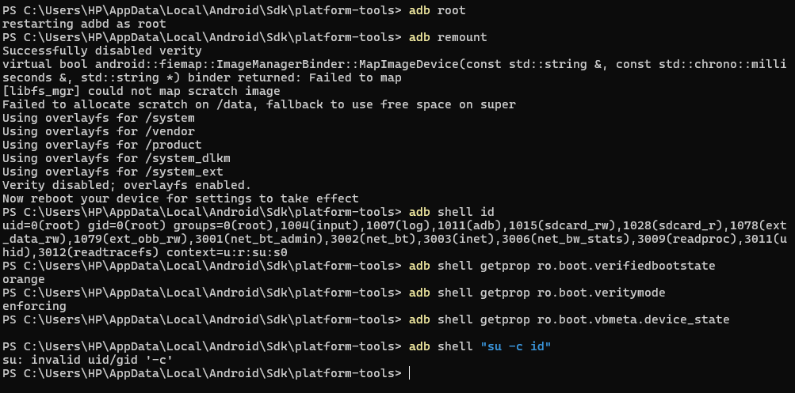
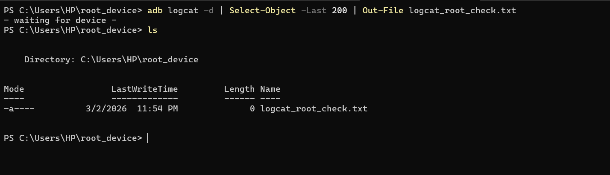

---

## Étape 2 : Fiche périmètre

| Champ | Valeur |
|---|---|
| **App + version** | ma.ens.myapplication — version 1.0 |
| **Support** | AVD — rooted_avd (Pixel 6, Android 36, Google APIs x86_64) |
| **Objectif** | Comprendre le rooting et ses impacts sur la sécurité Android |
| **Données** | Fictives uniquement |
| **Réseau** | Réseau de test isolé |

> Le périmètre de ce test est limité à un AVD nommé "rooted_avd", émulant un Pixel 6 sous Android 36 (Google APIs, x86_64), sans compte personnel ni données réelles. L'objectif est d'observer les effets du rooting sur les mécanismes de protection Android. Toutes les données utilisées sont fictives. Le réseau utilisé est un réseau de test isolé. Aucune manipulation ne sort du cadre du laboratoire autorisé.

---

## Étape 3 : Démarrer un AVD propre

L'AVD `rooted_avd` a été créé spécifiquement pour ce laboratoire avec les caractéristiques suivantes :
- Pixel 6, API 36, Google APIs, x86_64
- Aucun compte personnel configuré
- Aucune application préinstallée autre que les apps système

```powershell
adb devices
# emulator-5554   device
```

### Screenshot
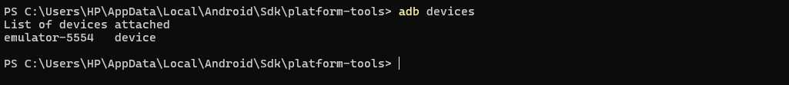

---

## Étape 4 : Installer et lancer l'app de test

```powershell
adb install app-debug.apk
# Performing Streamed Install
# Success

adb shell pm list packages -3
# package:ma.ens.myapplication
# package:com.topjohnwu.magisk
```

**Application installée :** `ma.ens.myapplication` — version 1.0  
**Note :** Magisk (`com.topjohnwu.magisk`) est également présent sur l'émulateur, confirmant l'environnement rooté.

### Screenshots
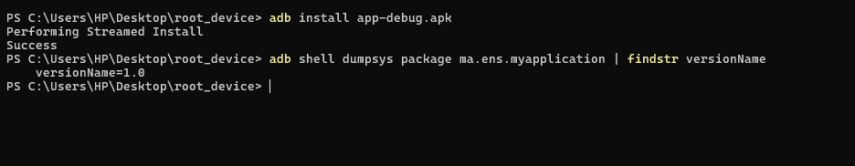
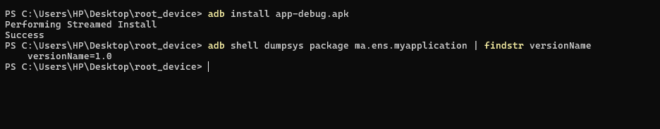

---

## Étape 5 : 3 scénarios simples

L'application `ma.ens.myapplication` est un formulaire de saisie de Nom et Prénom qui affiche une notification avec les données soumises.

### Scénario 1 — Ouvrir l'écran d'accueil
> Lancer l'application et vérifier que le formulaire avec les champs "Nom" et "Prénom" s'affiche correctement.

### Scénario 2 — Saisir des données fictives
> Saisir "Adansar" dans le champ Nom et "Abdessamad" dans le champ Prénom, puis appuyer sur le bouton "Envoyer".

### Scénario 3 — Vérifier la notification
> Confirmer que la notification affichant les données saisies ("Adansar Abdessamad") apparaît correctement après soumission du formulaire.

### Screenshots
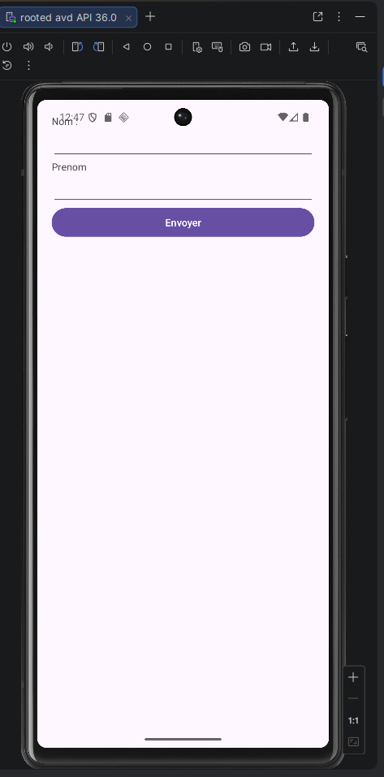
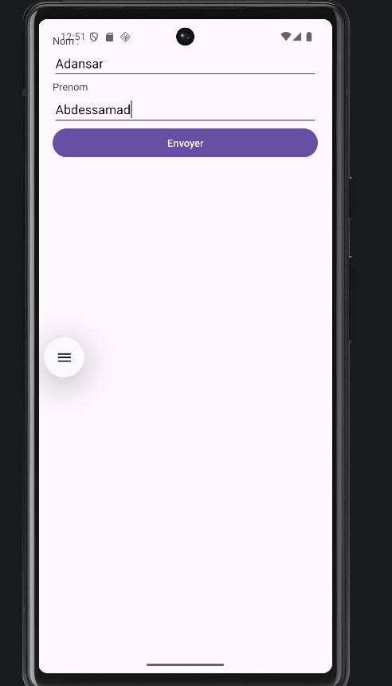
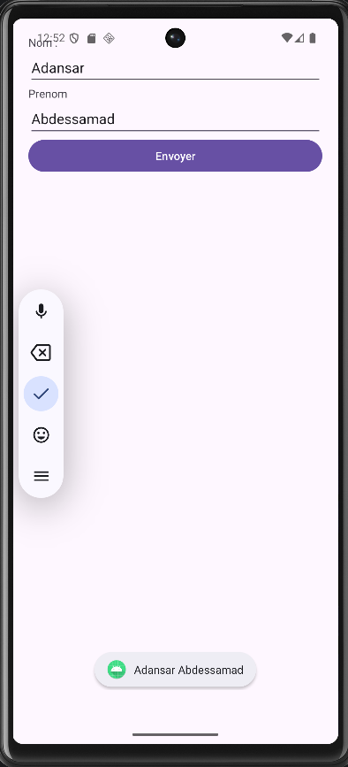

---

## Étape 6 : Sécurité Android — Résumé (6 lignes)

La sécurité Android repose sur plusieurs couches complémentaires :

1. **Sandboxing des applications** : chaque application s'exécute dans un environnement isolé, sans accès direct aux données des autres apps.
2. **Modèle de permissions** : l'accès aux ressources sensibles (caméra, contacts, localisation) nécessite une autorisation explicite de l'utilisateur.
3. **Isolation et intégrité globale du système** : le noyau Linux protège les processus et partitions système contre les modifications non autorisées.

Le rooting contourne ces trois couches en accordant un accès illimité à l'ensemble du système.

*Source : [Android Security Overview](https://source.android.com/docs/security)*

---

## Étape 7 : Verified Boot

### Objectif principal de Verified Boot
Garantir que le système qui démarre est celui prévu par le fabricant, sans modifications malveillantes.

### Chain of Trust (2 lignes)
Série de vérifications où chaque composant vérifie l'authenticité du suivant avant de lui faire confiance. Comme une chaîne de gardiens où chacun vérifie l'identité du suivant avant de le laisser passer.

### Pourquoi l'intégrité au démarrage est critique
Si le démarrage est compromis, toutes les protections ultérieures peuvent être contournées — comme une forteresse dont la porte principale serait forcée.

### Vérification sur notre AVD

```
ro.boot.verifiedbootstate = orange
```

**Interprétation :** Orange indique que le système a été modifié et que l'intégrité n'est plus garantie — résultat attendu après rooting.

| Couleur | Signification |
|---|---|
| 🟢 Green | Système vérifié et intègre |
| 🟡 Yellow/Orange | Système modifié, fonctionnel mais non garanti |
| 🔴 Red | Intégrité compromise, démarrage dangereux |

*Source : [Verified Boot](https://source.android.com/docs/security/features/verifiedboot)*

---

## Étape 8 : AVB (Android Verified Boot 2.0)

AVB est la version moderne et améliorée de Verified Boot. Il ajoute une vérification cryptographique de l'intégrité de chaque partition au démarrage, garantissant qu'aucune modification non autorisée n'a eu lieu. AVB intègre également une **protection anti-rollback** qui empêche l'installation d'anciennes versions du système pouvant contenir des failles connues — comme empêcher quelqu'un de remplacer une serrure moderne par un modèle obsolète facilement crochetable.

*Source : [Android Verified Boot](https://source.android.com/docs/security/features/verifiedboot/avb)*

---

## Étape 9 : Définition du rooting (4 phrases)

Le rooting consiste à obtenir les privilèges super-utilisateur (uid=0/root) sur un appareil Android, équivalent à l'accès administrateur sur Windows. Cela modifie fondamentalement les protections du système en contournant le sandbox, les permissions et l'intégrité des partitions. En laboratoire, le rooting est utile pour observer les comportements internes des applications, accéder aux données normalement protégées et tester la robustesse des mécanismes de sécurité. Cependant, il est risqué et nécessite un environnement isolé, une traçabilité complète et une remise à zéro obligatoire en fin de séance.

---

## Étape 10 : Intérêt labo (non opérationnel)

En labo, un environnement privilégié peut aider à :

- Observer des artefacts système normalement inaccessibles (partitions, fichiers protégés)
- Analyser les comportements runtime de l'application à bas niveau
- Tester la robustesse du stockage face à un attaquant privilégié
- Vérifier si une application implémente son propre chiffrement ou se repose uniquement sur les protections système

**Important : labo autorisé uniquement.** Ces manipulations ne doivent jamais être effectuées sur un appareil personnel ou en dehors du cadre défini.

---

## Étape 11 : Matrice de risques

| # | Risque | Impact |
|---|---|---|
| 1 | **Intégrité non garantie** | Conclusions biaisées sur la sécurité réelle |
| 2 | **Surface d'attaque accrue** | Exposition à des menaces externes si l'appareil sort du labo |
| 3 | **Données sensibles exposées** | Violation potentielle de confidentialité si données réelles présentes |
| 4 | **Instabilité système** | Tests non reproductibles et résultats incohérents |
| 5 | **Mélange comptes perso/test** | Fuite possible d'informations personnelles |
| 6 | **Mauvais nettoyage fin de séance** | Persistance de données sensibles sur l'AVD |
| 7 | **Réseau non isolé** | Effets involontaires sur systèmes externes |
| 8 | **Traçabilité insuffisante** | Impossible de reproduire ou d'auditer les tests |

---

## Étape 12 : Mesures défensives

| # | Mesure | Objectif |
|---|---|---|
| 1 | **Réseau isolé** | Éviter toute communication non contrôlée |
| 2 | **Données fictives uniquement** | Éliminer tout risque de fuite réelle |
| 3 | **AVD dédié exclusivement aux tests** | Aucune contamination avec l'environnement personnel |
| 4 | **Wipe en fin de séance** | Ne laisser aucune trace après le laboratoire |
| 5 | **Journal de configuration détaillé** | Assurer la reproductibilité des tests |
| 6 | **Aucun compte personnel** | Éviter tout mélange de données |
| 7 | **Contrôle strict des APK installées** | Limiter les risques d'applications malveillantes |
| 8 | **Horodatage + captures des étapes** | Traçabilité complète et auditabilité |

---

## Étape 13 : OWASP MASVS — 2 exigences

*Source : [OWASP MASVS](https://mas.owasp.org/MASVS)*

### STORAGE-1 — Stockage sécurisé des données sensibles
Les données sensibles comme les API keys, mots de passe ou tokens doivent être stockées de manière sécurisée en utilisant des fonctions de chiffrement appropriées. Une application ne doit jamais stocker ces informations en clair dans SharedPreferences, bases de données non chiffrées ou fichiers accessibles.

### NETWORK-1 — Communications réseau sécurisées
Les communications réseau doivent utiliser TLS avec une configuration correcte et vérifier les certificats serveur. L'utilisation de HTTP non chiffré ou de certificats auto-signés non validés constitue une violation critique de cette exigence.

---

## Étape 14 : OWASP MASTG — 2 tests pratiques

*Source : [OWASP MASTG](https://mas.owasp.org/MASTG)*

### Test 1 — Vérification du stockage local (STORAGE-1)

```powershell
adb shell ls /data/data/ma.ens.myapplication/
# cache
# code_cache
# files

adb shell ls /data/data/ma.ens.myapplication/shared_prefs/
# ls: No such file or directory

adb shell cat /data/data/ma.ens.myapplication/files/profileInstalled
# ���Z  (données binaires/sérialisées)
```

**Observation :** L'application stocke un fichier `profileInstalled` dans le dossier `files/` après soumission du formulaire. Les données sont encodées en binaire/sérialisé — non lisibles en clair. Aucune SharedPreferences trouvée. L'application respecte STORAGE-1 : les données ne sont pas stockées en texte clair.

### Test 2 — Analyse des logs pour fuites de données

```powershell
adb logcat -d | Select-Object -Last 100 | Out-File logcat_mastg.txt
```

**Observation :** Analyse du logcat pour détecter d'éventuelles fuites d'informations sensibles (Nom, Prénom) pendant l'exécution de l'application.

### Screenshot
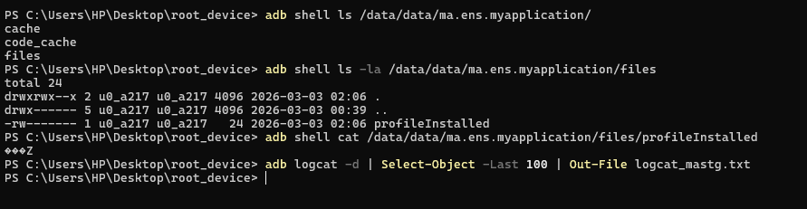

---

## Étape 15 : Commandes de rooting — Synthèse

```powershell
adb devices               # emulator-5554   device
adb shell id              # uid=0(root)
adb shell getprop ro.boot.verifiedbootstate   # orange
adb shell getprop ro.boot.veritymode          # enforcing
adb shell getprop ro.boot.vbmeta.device_state # (vide)
adb shell "su -c id"      # déjà root, su non nécessaire
```

**Option permissive utilisée :**
```powershell
adb remount
# Successfully disabled verity
# Using overlayfs for /system /vendor /product /system_dlkm /system_ext
# Verity disabled; overlayfs enabled.
```

### Screenshot
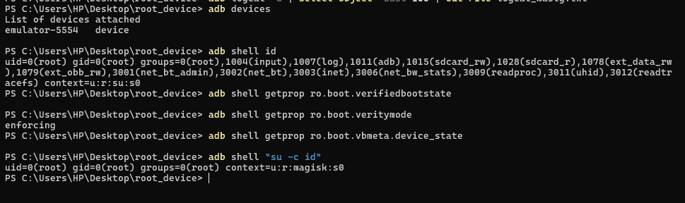

---

## Étape 16 : Fiche environnement

| Champ | Valeur |
|---|---|
| **Auteur** | Abdessamad Adansar |
| **Support** | AVD — rooted_avd |
| **Version Android** | Android 36 (API 36) |
| **Modèle** | Pixel 6 (Google APIs x86_64) |
| **App testée** | ma.ens.myapplication v1.0 |
| **Scénario 1** | Ouvrir l'écran d'accueil (formulaire Nom/Prénom) |
| **Scénario 2** | Saisir données fictives "Adansar / Abdessamad" et soumettre |
| **Scénario 3** | Vérifier l'affichage de la notification avec les données |
| **Observations** | App stocke données en binaire, pas de SharedPreferences en clair |
| **Limites** | AVD émulé, comportement peut différer d'un device physique |
| **Reset effectué** | ✅ Oui — Wipe Data via Android Studio Device Manager |

### Screenshots
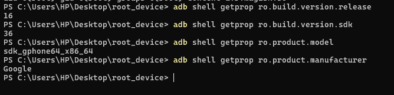

---

## Étape 17 : Remise à zéro AVD

La remise à zéro a été effectuée via **Android Studio → Device Manager → rooted_avd → Wipe Data**.

Après redémarrage, l'AVD affiche l'assistant de configuration initial Android, confirmant que toutes les données ont été effacées.

### Screenshots
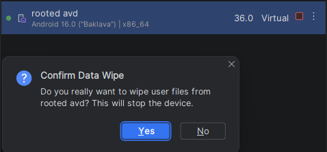
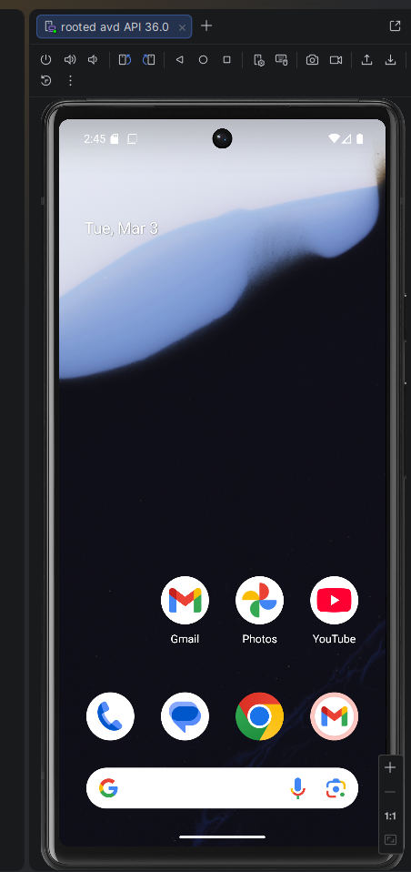

---

## Étape 19 : Livrables

### Schéma — Chaîne de confiance Verified Boot / AVB

```
[ROM/Matériel sécurisé]
        ↓ vérifie
[Bootloader]
        ↓ vérifie
[Vérification signature AVB]
        ↓ vérifie
[Boot Image (Kernel)]
        ↓ vérifie
[Partitions système (/system, /vendor)]
        ↓
[Android OS]
        ↓
[Applications sandboxées]

État normal  → verifiedbootstate = GREEN  ✅
État rooté   → verifiedbootstate = ORANGE ⚠️
État compromis → verifiedbootstate = RED  ❌
```

### Schéma — Impact du rooting

```
NORMAL :
App → Sandbox → Permissions → Système (protégé, lecture seule)

ROOTÉ :
App → Sandbox → Permissions → Système (modifiable) ← uid=0(root)
                                      ↑
                              overlayfs activé
                              verity désactivé
```

---

## Étape 20 : Checklist finale

### Début de séance
- [x] Périmètre écrit
- [x] AVD neuf (rooted_avd)
- [x] App test installée (ma.ens.myapplication v1.0)
- [x] 3 scénarios notés
- [x] Versions Android (36) et app (1.0) notées

### Fin de séance
- [x] Reset effectué (Wipe Data via Android Studio)
- [x] Preuve du reset (`etape17_wipe.png` + `etape17_fresh_boot.png`)
- [x] Rapport + traçabilité sauvegardés
- [x] Aucun compte personnel utilisé

---

## Ressources

| Ressource | Lien |
|---|---|
| Android Security | https://source.android.com/docs/security |
| Verified Boot | https://source.android.com/docs/security/features/verifiedboot |
| AVB | https://source.android.com/docs/security/features/verifiedboot/avb |
| OWASP MASVS | https://mas.owasp.org/MASVS |
| OWASP MASTG | https://mas.owasp.org/MASTG |

---

*© 2026 — LAB 2 Rooting Android — Sécurité des applications mobiles*
