# 🔬 LAB 3 — Observation du trafic HTTP(S) Android avec Burp Suite

**Cours** : Sécurité des applications mobiles — MLIAEdu  
**Auteur :** Abdessamad Adansar 
**Plateforme** : Android Emulator (Android 16) + Burp Suite Community  
**Environnement** : Windows, réseau de labo isolé  

---

## 📋 Objectifs

- Vérifier qu'un navigateur Android envoie son trafic via Burp
- Identifier les éléments essentiels d'une requête (URL, méthode, headers, cookies, paramètres)
- Expliquer la différence HTTP vs HTTPS et le rôle d'un certificat CA en labo
- Produire une trace d'audit simple (preuves + contexte)

---

## 🛠️ Prérequis

| Composant | Détail |
|-----------|--------|
| Burp Suite Community | Installé sur la machine hôte |
| Android Studio | Émulateur Android 16 fonctionnel |
| Réseau | Réseau de labo isolé |
| Cible autorisée | `http://testphp.vulnweb.com` |

---

## ⚙️ Configuration du labo

| Paramètre | Valeur |
|-----------|--------|
| `<IP_HOTE>` | `10.173.22.3` |
| `<PORT_PROXY>` | `8080` |
| Listener Burp | `0.0.0.0:8080` (All interfaces) |
| Version Android | Android 16 |

---

## 🚀 Étapes du Lab

### Étape 1 — Lancer Burp Suite

Lancer Burp Suite Community, créer un projet temporaire avec les options par défaut.

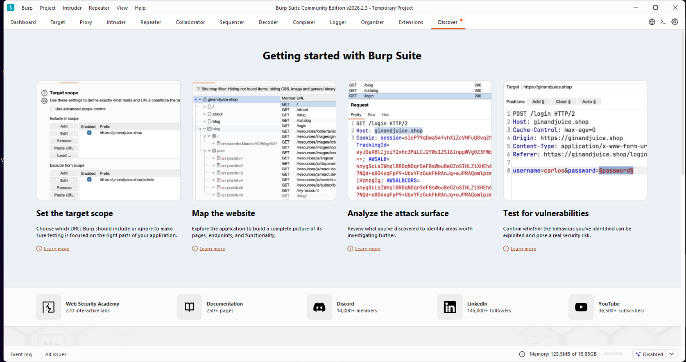

---

### Étape 2 — Configurer le Proxy Listener

Dans **Proxy → Proxy settings → Proxy Listeners**, éditer le listener et définir l'adresse sur `0.0.0.0` avec le port `8080` pour écouter sur toutes les interfaces réseau.

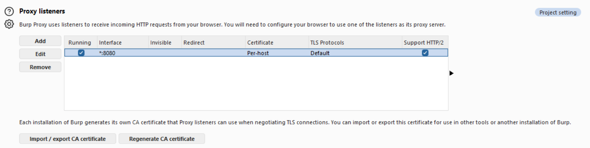

---

### Étape 3 — Identifier l'adresse IP de la machine hôte

Sur Windows, exécuter `ipconfig` dans le terminal et noter l'adresse IPv4 du réseau Wi-Fi.

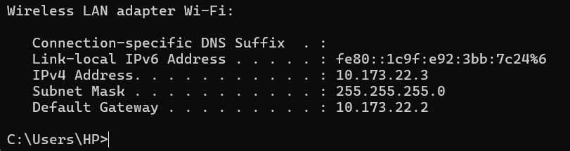

---

### Étape 4 — Vérifier la version Android de l'émulateur

Dans l'émulateur, aller dans **Paramètres → About emulated device** pour noter la version Android.

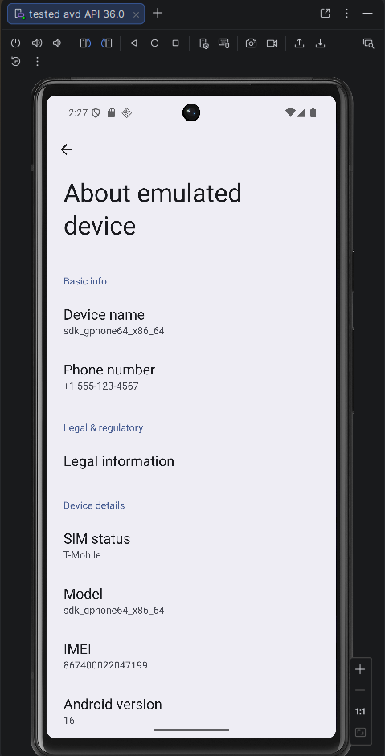

---

### Étape 5 — Configurer le proxy sur l'émulateur Android

Dans **Paramètres → Wi-Fi → Modifier le réseau → Options avancées**, définir le proxy en mode **Manual** avec l'IP hôte et le port Burp.

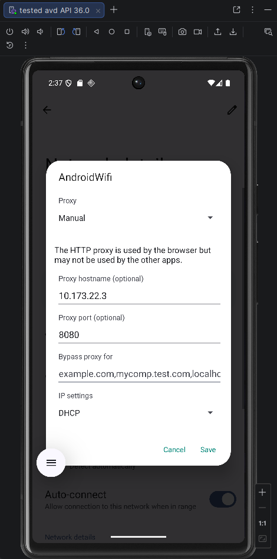

---

### Étape 6 — Capturer du trafic HTTP

Ouvrir le navigateur de l'émulateur, accéder à `http://testphp.vulnweb.com`, puis vérifier dans **Burp → HTTP history** que les requêtes apparaissent bien.

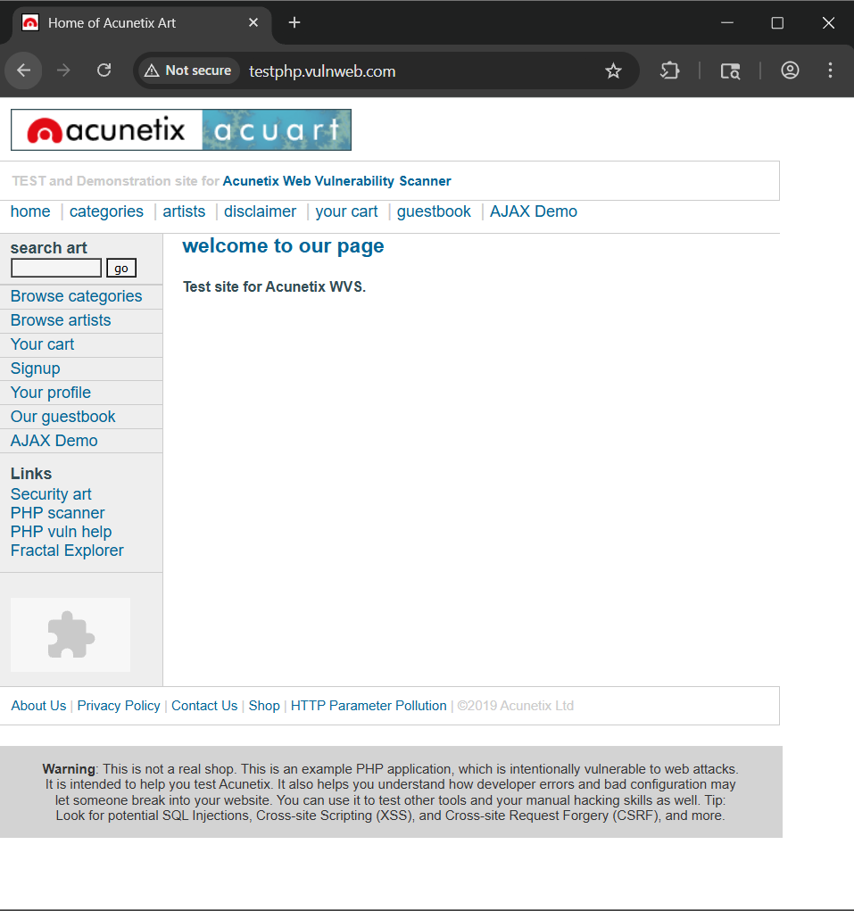

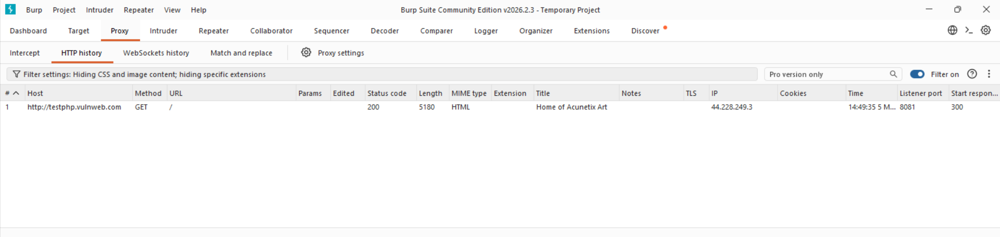

---

### Étape 7 — Analyser une requête (Raw + Inspector)

Sélectionner une requête dans l'historique et l'analyser via les onglets **Raw** et **Inspector**.

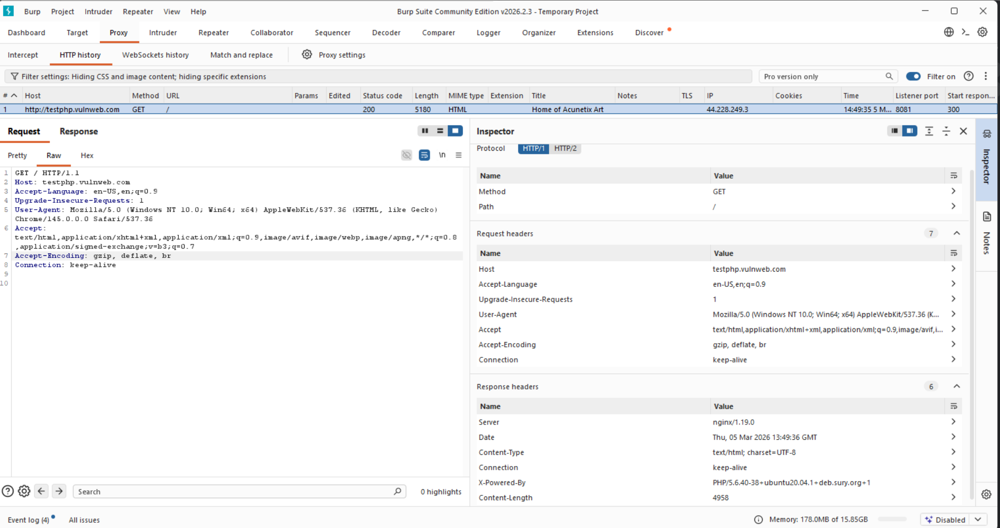

#### 🔍 Findings observés

| Élément | Valeur | Observation |
|---------|--------|-------------|
| Méthode | `GET` | Page d'accueil |
| User-Agent | `Chrome/145.0.0.0` | Navigateur récent |
| Cookies | Aucun | Pas de session active |
| `X-Powered-By` | `PHP/5.6.40` | ⚠️ Version obsolète exposée |
| Serveur | `nginx/1.19.0` | ⚠️ Version exposée |
| Protocole | HTTP | ⚠️ Trafic en clair |

---

### Étape 8 — Interception contrôlée

Activer **"Intercept is on"**, rafraîchir une page dans l'émulateur, observer la requête bloquée dans Burp, puis cliquer **Forward** et désactiver l'interception.

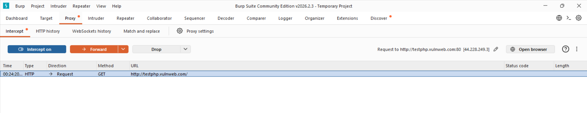

---

### Étape 9 — Observation du certificat CA (HTTPS)

Dans **Paramètres → Security → Encryption & credentials → Install a certificate**, observer les types de certificats disponibles sans en installer.

> 💡 HTTPS chiffre le trafic et empêche Burp de le lire. Un certificat CA de labo installé dans l'émulateur permet de déchiffrer ce trafic en environnement de test uniquement.

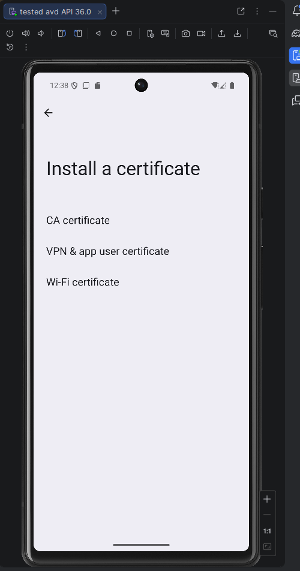

---

### Étape 10 — Nettoyage (hygiène de fin de lab)

Retourner dans les paramètres Wi-Fi de l'émulateur et remettre le proxy sur **None**.

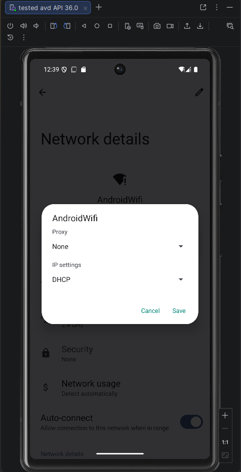

---

## ✅ Checkpoints de validation

| # | Checkpoint | Statut |
|---|-----------|--------|
| 1 | Burp capture des requêtes dans HTTP history | ✅ |
| 2 | Proxy listener actif sur `0.0.0.0:8080` | ✅ |
| 3 | Proxy Android en Manual avec `10.173.22.3:8080` | ✅ |
| 4 | Intercept utilisé pour démonstration puis désactivé | ✅ |
| 5 | Analyse d'une requête (headers + findings) | ✅ |
| 6 | Écran certificat CA observé | ✅ |
| 7 | Nettoyage effectué (proxy remis sur None) | ✅ |

---

## 🔐 Recommandations défensives

- **Masquer les versions serveur** : supprimer les headers `X-Powered-By` et `Server` pour éviter le fingerprinting
- **Mettre à jour PHP** : PHP 5.6 est end-of-life depuis 2018, vulnérable à de nombreux CVEs connus
- **Forcer HTTPS** : rediriger tout trafic HTTP vers HTTPS pour chiffrer les échanges
- **Sécuriser les cookies** : ajouter les attributs `Secure` et `HttpOnly` sur tous les cookies de session

---

## 📁 Structure du projet

```
Lab3/
├── images/
│   ├── 01_burp_suite_launch.png
│   ├── 02_proxy_listener_0000_8080.png
│   ├── 03_ipconfig_host_ip.png
│   ├── 04_android_version.png
│   ├── 05_emulator_proxy_manual.png
│   ├── 06_burp_http_history.png
│   ├── 07_emulator_browser_target.png
│   ├── 08_burp_request_raw_inspector.png
│   ├── 09_burp_intercept_blocked.png
│   ├── 10_android_certificate_screen.png
│   └── 11_emulator_proxy_none.png
└── README.md
```
