# LAB 4 — Analyse statique d'un APK avec JADX GUI + dex2jar + JD-GUI

> **Cours :** Sécurité des applications mobiles — MLIAEdu  
> **Date :** 13 Mars 2026  
> **Analyste :** Abdessamad Adansar
> **APK analysé :** UnCrackable-Level1.apk (OWASP MSTG)

---

## 🗺️ Table des matières

1. [Vue d'ensemble](#vue-densemble)
2. [Outils utilisés](#outils-utilisés)
3. [Task 1 — Préparer le workspace et vérifier l'APK](#task-1--préparer-le-workspace-et-vérifier-lapk)
4. [Task 2 — Obtenir l'APK](#task-2--obtenir-lapk)
5. [Task 3 — Analyse avec JADX GUI](#task-3--analyse-avec-jadx-gui)
6. [Task 4 — Recherche de chaînes sensibles](#task-4--recherche-de-chaînes-sensibles)
7. [Task 5 — Convertir DEX → JAR avec dex2jar](#task-5--convertir-dex--jar-avec-dex2jar)
8. [Task 6 — Comparaison JADX vs JD-GUI](#task-6--comparaison-jadx-vs-jd-gui)
9. [Task 7 — Rapport d'audit](#task-7--rapport-daudit)
10. [Task 8 — Nettoyage](#task-8--nettoyage)
11. [Résumé des vulnérabilités](#résumé-des-vulnérabilités)

---

## Vue d'ensemble

Ce lab couvre l'analyse statique d'une application Android (APK) sans l'exécuter.
L'APK utilisé est **UnCrackable Level 1** de l'OWASP Mobile Security Testing Guide (MSTG),
une application intentionnellement vulnérable conçue à des fins pédagogiques.

---

## Outils utilisés

| Outil | Version | Usage |
|---|---|---|
| JADX GUI | 1.5.5 | Décompilation APK + exploration ressources |
| dex2jar | 2.1-SNAPSHOT | Conversion DEX → JAR |
| JD-GUI | 1.6.6 | Décompilation JAR (comparaison) |
| PowerShell | Windows | Commandes système |

---

## Task 1 — Préparer le workspace et vérifier l'APK

### Création du dossier de travail

```powershell
mkdir C:\Users\HP\Desktop\APK-Analysis
cd C:\Users\HP\Desktop\APK-Analysis
```

### Vérification de la signature ZIP de l'APK

```powershell
Get-Content -Path .\UnCrackable-Level1.apk -TotalCount 4 | Format-Hex
```

✅ Les 2 premiers octets `50 4B` = "PK" confirment que l'APK est une archive ZIP valide.

### Hash SHA-256 pour traçabilité

```powershell
Get-FileHash -Algorithm SHA256 .\UnCrackable-Level1.apk
```

```
SHA256: 1DA8BF57D266109F9A07C01BF7111A1975CE01F190B9D914BCD3AE3DBEF96F21
```

### Contenu de l'APK

```powershell
Add-Type -Assembly System.IO.Compression.FileSystem
$apk = Join-Path (Get-Location) "UnCrackable-Level1.apk"
[System.IO.Compression.ZipFile]::OpenRead($apk).Entries | Select-Object -ExpandProperty FullName
```

```
AndroidManifest.xml
META-INF/CERT.RSA
META-INF/CERT.SF
META-INF/MANIFEST.MF
classes.dex
res/layout/activity_main.xml
res/menu/menu_main.xml
res/mipmap-hdpi-v4/ic_launcher.png
res/mipmap-mdpi-v4/ic_launcher.png
res/mipmap-xhdpi-v4/ic_launcher.png
res/mipmap-xxhdpi-v4/ic_launcher.png
res/mipmap-xxxhdpi-v4/ic_launcher.png
resources.arsc
```

📸 **Screenshot :**
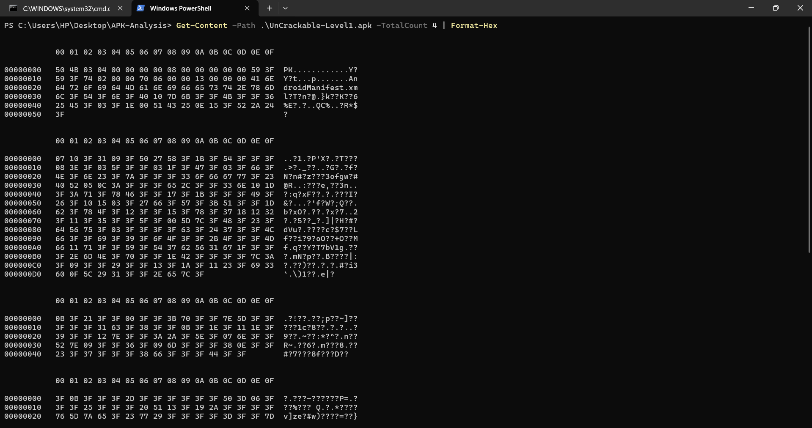
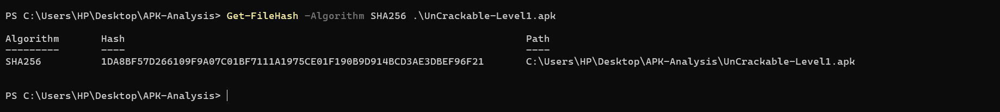

---

## Task 2 — Obtenir l'APK

**Source :** OWASP MSTG CrackMes — https://mas.owasp.org/crackmes/Android/

| Champ | Valeur |
|---|---|
| Nom du fichier | UnCrackable-Level1.apk |
| Taille | 66 651 octets |
| Provenance | OWASP MSTG (application pédagogique) |
| SHA-256 | 1DA8BF57D266109F9A07C01BF7111A1975CE01F190B9D914BCD3AE3DBEF96F21 |

---

## Task 3 — Analyse avec JADX GUI

### Ouverture de l'APK

Lancement de JADX GUI → File → Open file → UnCrackable-Level1.apk

📸 **Screenshot :**
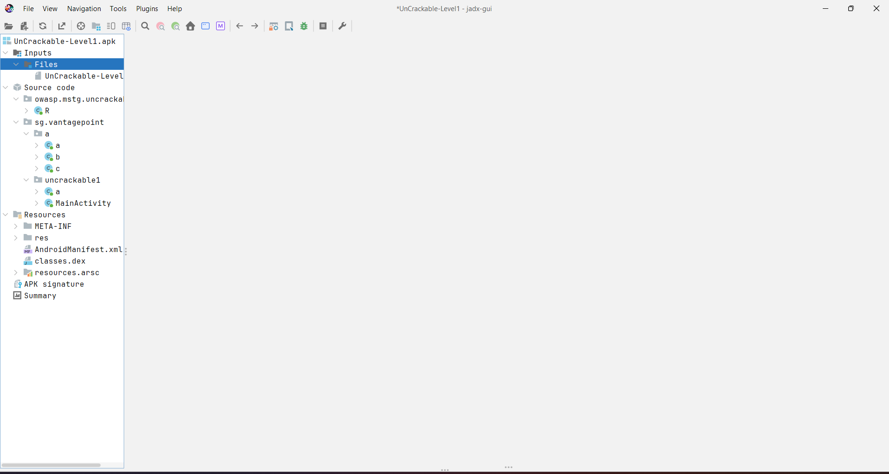

---

### Analyse du AndroidManifest.xml

```xml
<manifest package="owasp.mstg.uncrackable1"
          android:versionCode="1"
          android:versionName="1.0">

    <uses-sdk android:minSdkVersion="19"
              android:targetSdkVersion="28"/>

    <application android:allowBackup="true"
                 android:label="@string/app_name">

        <activity android:name="sg.vantagepoint.uncrackable1.MainActivity">
            <intent-filter>
                <action android:name="android.intent.action.MAIN"/>
                <category android:name="android.intent.category.LAUNCHER"/>
            </intent-filter>
        </activity>

    </application>
</manifest>
```

**Observations :**

| Champ | Valeur | Risque |
|---|---|---|
| Package | owasp.mstg.uncrackable1 | — |
| Version | 1.0 | — |
| minSdk | 19 (Android 4.4) | — |
| targetSdk | 28 (Android 9) | — |
| allowBackup | true | 🔴 ÉLEVÉ |
| debuggable | non défini | 🟡 À NOTER |
| usesCleartextTraffic | non défini | 🟢 OK |
| Permissions | Aucune | 🟢 OK |

📸 **Screenshot :**
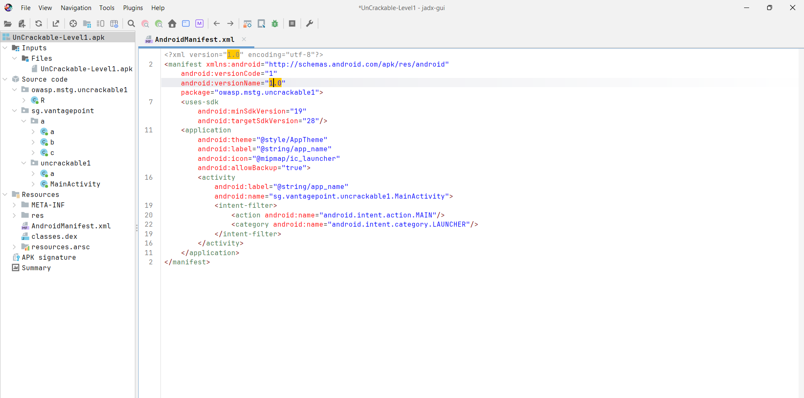

---

### Analyse de strings.xml

```xml
<resources>
    <string name="action_settings">Uncrackable1</string>
    <string name="app_name">Uncrackable1</string>
    <string name="button_verify">Verify</string>
    <string name="edit_text">Enter the Secret String</string>
    <string name="thanks">With special thanks to Bernhard Mueller...</string>
</resources>
```

**Observation :** La chaîne `"Enter the Secret String"` confirme que l'app attend un secret.
Ce secret n'est **pas** dans les ressources XML → il est dans le code Java.

📸 **Screenshot :**
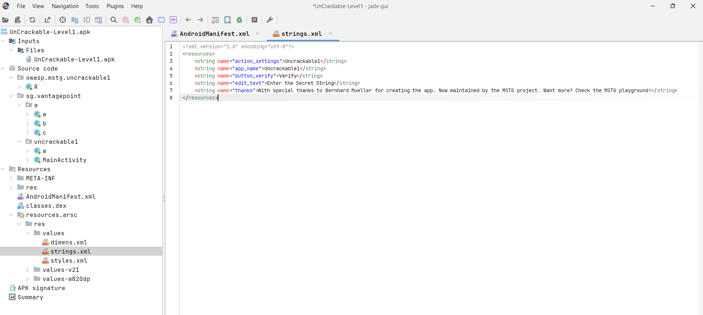

---

## Task 4 — Recherche de chaînes sensibles

### MainActivity.java

```java
protected void onCreate(Bundle bundle) {
    if (c.a() || c.b() || c.c()) {
        a("Root detected!");       // Anti-root
    }
    if (b.a(getApplicationContext())) {
        a("App is debuggable!");   // Anti-debug
    }
}

public void verify(View view) {
    String string = ((EditText) findViewById(R.id.edit_text)).getText().toString();
    if (a.a(string)) {             // Vérification dans la classe "a" !
        alertDialog.setTitle("Success!");
    }
}
```

📸 **Screenshot :**
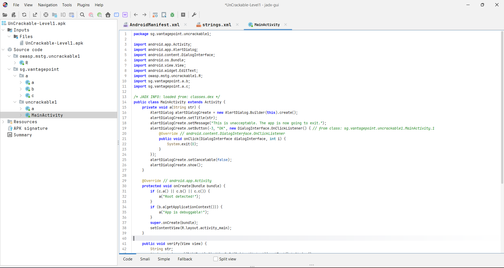

---

### Classe a.java — Mécanisme de vérification du secret

```java
public static boolean a(String str) {
    // Clé AES hardcodée en hexadécimal !
    byte[] key = b("8d127684cbc37c17616d806cf50473cc");

    // Données chiffrées hardcodées en Base64 !
    byte[] encrypted = Base64.decode("5UJiFctbmgbDoLXmpL12mkno8HT4Lv8dlat8FxR2GOc=", 0);

    // Déchiffrement AES
    byte[] secret = sg.vantagepoint.a.a.a(key, encrypted);

    // Comparaison avec l'input utilisateur
    return str.equals(new String(secret));
}
```

**🚨 Découvertes critiques :**
- Clé AES hardcodée : `8d127684cbc37c17616d806cf50473cc`
- Données chiffrées hardcodées : `5UJiFctbmgbDoLXmpL12mkno8HT4Lv8dlat8FxR2GOc=`

📸 **Screenshot :**
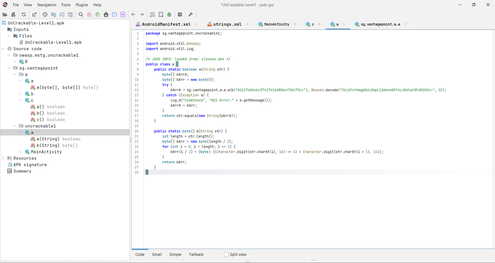

---

### Classe sg.vantagepoint.a.a — Déchiffrement AES

```java
public static byte[] a(byte[] bArr, byte[] bArr2) {
    SecretKeySpec secretKeySpec = new SecretKeySpec(bArr, "AES/ECB/PKCS7Padding");
    Cipher cipher = Cipher.getInstance("AES"); // Mode ECB par défaut !
    cipher.init(2, secretKeySpec);             // 2 = DECRYPT_MODE
    return cipher.doFinal(bArr2);
}
```

**🚨 AES en mode ECB — algorithme faible sans vecteur d'initialisation !**

📸 **Screenshot :**
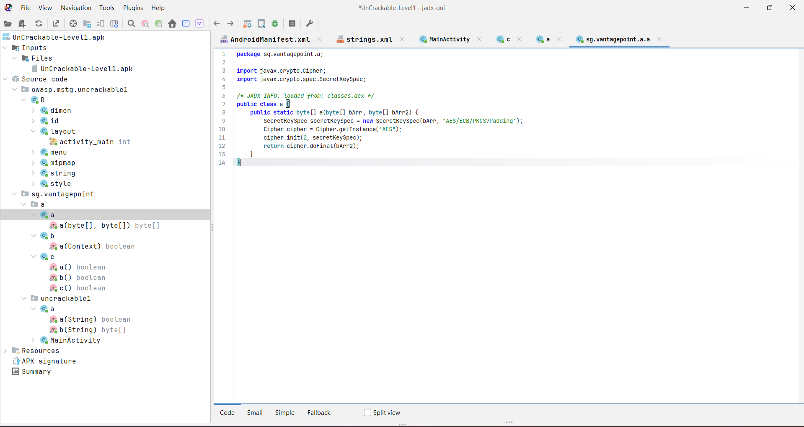

---

## Task 5 — Convertir DEX → JAR avec dex2jar

### Extraction de classes.dex

```powershell
Add-Type -Assembly System.IO.Compression.FileSystem
$zip = [System.IO.Compression.ZipFile]::OpenRead("C:\Users\HP\Desktop\APK-Analysis\UnCrackable-Level1.apk")
$zip.Entries | Where-Object {$_.Name -like "classes*.dex"} | ForEach-Object {
    [System.IO.Compression.ZipFileExtensions]::ExtractToFile($_, "C:\Users\HP\Desktop\APK-Analysis\dex_out\$($_.Name)", $true)
}
$zip.Dispose()
```

### Conversion DEX → JAR

```powershell
cd C:\Users\HP\Desktop\APK-Analysis\tools\dex-tools-2.1-SNAPSHOT
.\d2j-dex2jar.bat C:\Users\HP\Desktop\APK-Analysis\dex_out\classes.dex -o C:\Users\HP\Desktop\APK-Analysis\results\app.jar
```

📸 **Screenshot :**
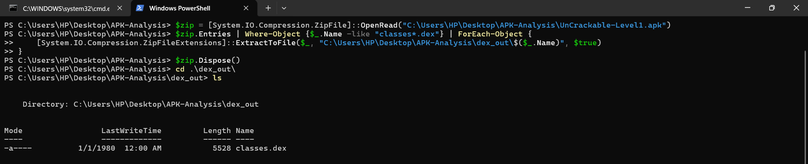
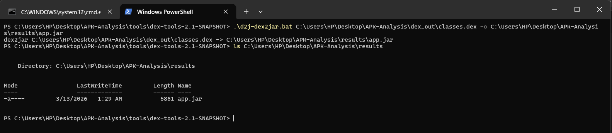

---

## Task 6 — Comparaison JADX vs JD-GUI

### JD-GUI — MainActivity (extrait)

```java
// JD-GUI utilise des nombres bruts au lieu des noms de ressources
setContentView(2130903040);      // vs R.layout.activity_main dans JADX
findViewById(2130837505)         // vs R.id.edit_text dans JADX
```

### Tableau comparatif

| Aspect | JADX GUI | JD-GUI |
|---|---|---|
| Navigation | Ressources + Code ✅ | Code uniquement ❌ |
| Ressources XML | AndroidManifest, strings.xml ✅ | Non disponibles ❌ |
| IDs Android | `R.layout.activity_main` ✅ | `2130903040` ❌ |
| Lisibilité | Très bonne ✅ | Correcte 🟡 |
| Packages | Tous visibles ✅ | Partiel 🟡 |
| Noms paramètres | Reconstruits ✅ | Génériques 🟡 |
| **Conclusion** | **Outil principal recommandé** | **Outil secondaire** |

📸 **Screenshot :**
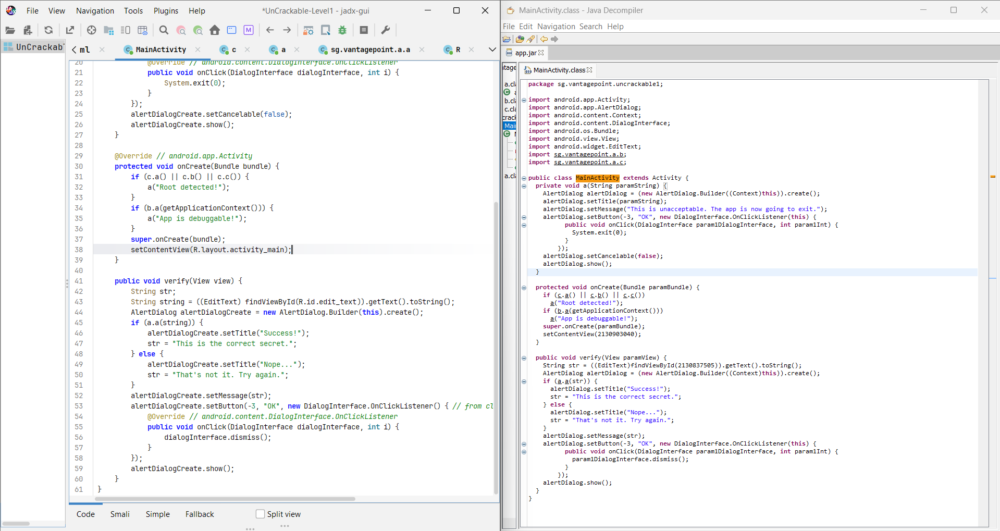

---

## Task 7 — Rapport d'audit

Le rapport complet est disponible dans :
```
results/rapport_audit_UnCrackable1.docx
```

---

## Task 8 — Nettoyage

```powershell
# Organisation des fichiers
move .\UnCrackable-Level1.apk .\results\
move .\dex_out\classes.dex .\results\

# Suppression des artefacts temporaires
Remove-Item -Recurse -Force .\dex_out\

# Vérification de la structure finale
tree C:\Users\HP\Desktop\APK-Analysis /F
```

📸 **Screenshot :**
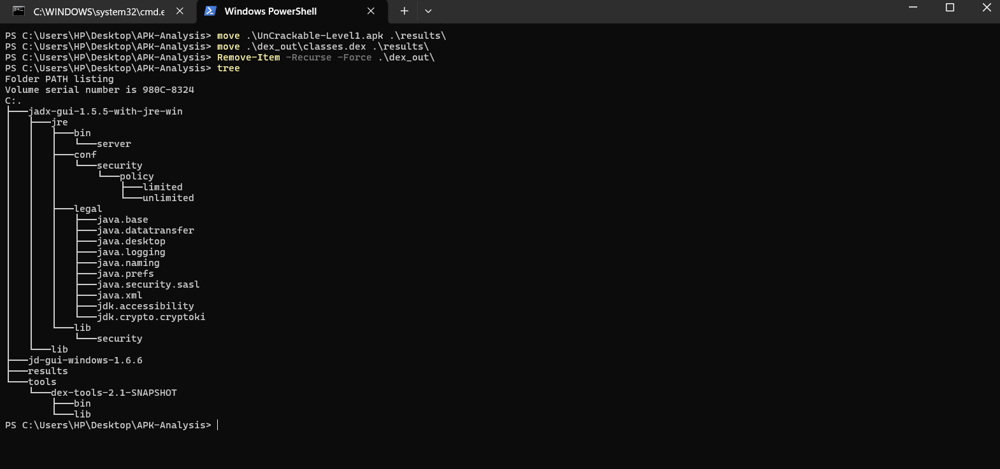

---

## Résumé des vulnérabilités

| # | Titre | Sévérité | Fichier |
|---|---|---|---|
| 1 | Backup ADB non restreint | 🔴 Élevée | AndroidManifest.xml |
| 2 | Clé AES hardcodée | 🔴 Élevée | sg.vantagepoint.uncrackable1.a |
| 3 | AES mode ECB | 🔴 Élevée | sg.vantagepoint.a.a |
| 4 | Données chiffrées hardcodées | 🟠 Moyenne | sg.vantagepoint.uncrackable1.a |
| 5 | Anti-tampering contournable | 🟠 Moyenne | MainActivity |

---

## Checklist finale

- [x] Dossier de travail créé
- [x] APK vérifié comme archive valide
- [x] Hash SHA-256 noté pour traçabilité
- [x] AndroidManifest.xml analysé
- [x] strings.xml analysé
- [x] Code source décompilé avec JADX GUI
- [x] Chaînes sensibles identifiées
- [x] DEX converti en JAR avec dex2jar
- [x] Comparaison JADX vs JD-GUI effectuée
- [x] Mini-rapport d'audit rédigé
- [x] Workspace nettoyé
- [x] Screenshots documentés

---

*© 2026 MLIAEdu Platform — LAB 4 Analyse statique d'APK*
